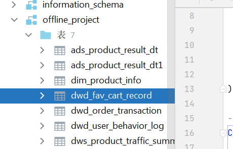
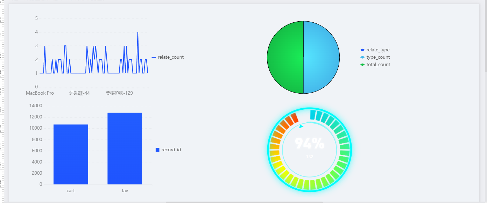

# 最近上新板块
with o.execute_sql("""
SELECT
pi.product_id,
pi.product_title,
pi.product_code,
pi.product_image,
poh.online_date,
poh.online_time,
COALESCE(SUM(CASE
WHEN oi.payment_status = 1
AND oi.payment_time >= poh.online_time
AND oi.payment_time <= DATEADD(poh.online_time, 30, 'dd')
THEN oi.payment_amount ELSE 0
END), 0) as total_payment_30d,
ROW_NUMBER() OVER (ORDER BY poh.online_time DESC) as rn
FROM df_cb_322001.realtime_v2_ods_product_info pi
LEFT JOIN df_cb_322001.realtime_v2_ods_product_online_history poh
ON pi.product_id = poh.product_id
AND poh.online_status = 1
AND poh.ds = (SELECT MAX(ds) FROM df_cb_322001.realtime_v2_ods_product_online_history)
LEFT JOIN df_cb_322001.realtime_v2_ods_order_info oi
ON pi.product_id = oi.product_id
AND oi.ds = (SELECT MAX(ds) FROM df_cb_322001.realtime_v2_ods_order_info)
WHERE pi.ds = (SELECT MAX(ds) FROM df_cb_322001.realtime_v2_ods_product_info)
AND poh.online_time IS NOT NULL
GROUP BY
pi.product_id, pi.product_title, pi.product_code, pi.product_image,
poh.online_date, poh.online_time
HAVING total_payment_30d >= 0
ORDER BY poh.online_time DESC
LIMIT 50
""").open_reader() as reader:
for record in reader:
print(record)

# 新品监控板块
with o.execute_sql("""
SELECT
'最近30天' as period_type,
COUNT(DISTINCT pi.product_id) as new_product_count,
COALESCE(SUM(CASE
WHEN oi.payment_status = 1
AND oi.payment_time >= poh.online_time
AND oi.payment_time <= DATEADD(poh.online_time, 30, 'dd')
THEN oi.payment_amount ELSE 0
END), 0) as total_payment_amount,
COUNT(DISTINCT CASE WHEN oi.payment_status = 1 THEN oi.order_id END) as total_order_count,
COUNT(DISTINCT CASE WHEN oi.payment_status = 1 THEN oi.user_id END) as total_user_count,
CASE
WHEN COUNT(DISTINCT ub.user_id) > 0
THEN ROUND(COUNT(DISTINCT CASE WHEN oi.payment_status = 1 THEN oi.order_id END) * 100.0 / COUNT(DISTINCT ub.user_id), 2)
ELSE 0
END as conversion_rate
FROM df_cb_322001.realtime_v2_ods_product_info pi
INNER JOIN df_cb_322001.realtime_v2_ods_product_online_history poh
ON pi.product_id = poh.product_id
AND poh.online_status = 1
AND poh.ds = (SELECT MAX(ds) FROM df_cb_322001.realtime_v2_ods_product_online_history)
INNER JOIN df_cb_322001.realtime_v2_ods_product_new_tag pnt
ON pi.product_id = pnt.product_id
AND pnt.is_tmall_new_product = 1
AND pnt.ds = (SELECT MAX(ds) FROM df_cb_322001.realtime_v2_ods_product_new_tag)
LEFT JOIN df_cb_322001.realtime_v2_ods_order_info oi
ON pi.product_id = oi.product_id
AND oi.ds = (SELECT MAX(ds) FROM df_cb_322001.realtime_v2_ods_order_info)
LEFT JOIN (
SELECT user_id, product_id
FROM df_cb_322001.realtime_v2_ods_user_behavior
WHERE ds = (SELECT MAX(ds) FROM df_cb_322001.realtime_v2_ods_user_behavior)
AND behavior_type = 'pv'
GROUP BY user_id, product_id
) ub ON pi.product_id = ub.product_id
WHERE pi.ds = (SELECT MAX(ds) FROM df_cb_322001.realtime_v2_ods_product_info)
AND poh.online_time IS NOT NULL
GROUP BY '最近30天'
""").open_reader() as reader:
for record in reader:
print(record)

# 新品全年复盘
with o.execute_sql("""
SELECT
poh.online_date,
COUNT(DISTINCT pi.product_id) as new_product_count,
COALESCE(SUM(CASE
WHEN oi.payment_status = 1
AND oi.payment_time >= poh.online_time
AND oi.payment_time <= DATEADD(poh.online_time, 30, 'dd')
THEN oi.payment_amount ELSE 0
END), 0) as total_payment_30d,
YEAR(poh.online_date) as year,
MONTH(poh.online_date) as month,
DAY(poh.online_date) as day
FROM df_cb_322001.realtime_v2_ods_product_info pi
INNER JOIN df_cb_322001.realtime_v2_ods_product_online_history poh
ON pi.product_id = poh.product_id
AND poh.online_status = 1
AND poh.ds = (SELECT MAX(ds) FROM df_cb_322001.realtime_v2_ods_product_online_history)
LEFT JOIN df_cb_322001.realtime_v2_ods_order_info oi
ON pi.product_id = oi.product_id
AND oi.ds = (SELECT MAX(ds) FROM df_cb_322001.realtime_v2_ods_order_info)
WHERE pi.ds = (SELECT MAX(ds) FROM df_cb_322001.realtime_v2_ods_product_info)
AND poh.online_time IS NOT NULL
GROUP BY
poh.online_date,
YEAR(poh.online_date),
MONTH(poh.online_date),
DAY(poh.online_date)
ORDER BY poh.online_date
""").open_reader() as reader:
for record in reader:
print(record)

完成工单5，6
完成工单五的大屏

