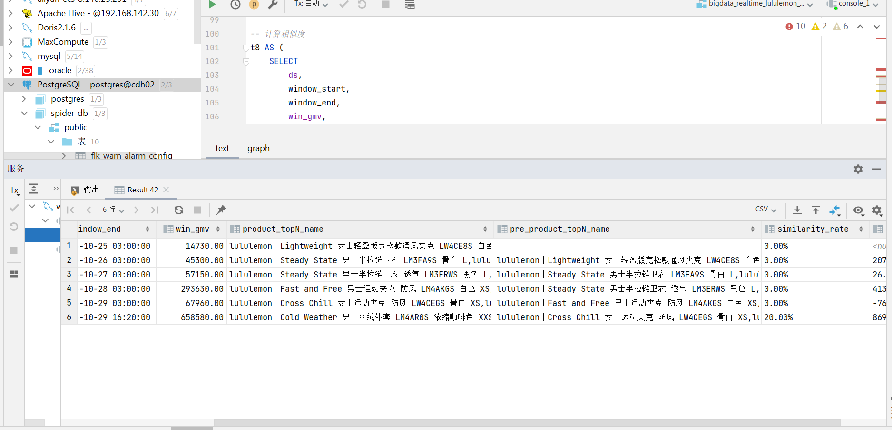

doris sql完成

with t1 as (
select
ds,
str_to_date(window_start,'yyyy-MM-dd HH:mm:ss') as window_start,
str_to_date(window_end,'yyyy-MM-dd HH:mm:ss') as window_end,
win_gmv,
top5_product_ids
from bigdata_realtime_lululemon_report_v1.report_lululemon_window_gmv_topN
order by ds
),
t2 as(
select *
from (
select *,
row_number() over (partition by ds order by window_end desc) as rn
from t1
) as t2
where rn=1
),
t3 as (
select * from (
select ds,
window_start,
window_end,
win_gmv,
product_id
from t2
lateral view explode_split(top5_product_ids,',') tmp as product_id
) as tmp

    ),
     t4 as (
         select ds,
               window_start,
               window_end,
               win_gmv,
               a.product_id,
               b.product_desc
         from t3 as a
         left join pg_catalog.public.spider_lululemon_jd_product_dtl as b
         on a.product_id=b.product_id
     ),
     t5 as (
         select * from (
                     select *,
                        row_number() over (partition by ds,product_id order by ds) as rn
                     from t4
                           )  as tmp
        where rn=1
     ),
    t6 as(
        select ds, window_start, window_end, win_gmv,
                GROUP_CONCAT(product_desc, ',') AS product_topN_name
        from t5
        group by ds, window_start, window_end, win_gmv
    ),
-- 新增部分：计算与前一天的商品重叠率（相似度）
t7 AS (
SELECT
cur.ds,
cur.window_start,
cur.window_end,
cur.win_gmv,
cur.product_topN_name,
lag(cur.product_topN_name, 1, '') OVER (ORDER BY cur.ds) AS pre_product_topN_name,
lag(cur.win_gmv, 1, 0) OVER (ORDER BY cur.ds) AS pre_win_gmv
FROM t6 cur
),

-- 计算相似度
t8 AS (
SELECT
ds,
window_start,
window_end,
win_gmv,
product_topN_name,
pre_product_topN_name,
-- ✅ 拼接百分号
CONCAT(
ROUND(
(
CARDINALITY(
array_intersect(
split_by_string(product_topN_name, ','),
split_by_string(pre_product_topN_name, ',')
)
) / 5.0 * 100
), 2
), '%'
) AS similarity_rate,
CONCAT(
ROUND((win_gmv - pre_win_gmv) / NULLIF(pre_win_gmv, 0) * 100, 2),
'%'
) AS MON_RATE
FROM t7
)

SELECT *
FROM t8
ORDER BY ds;