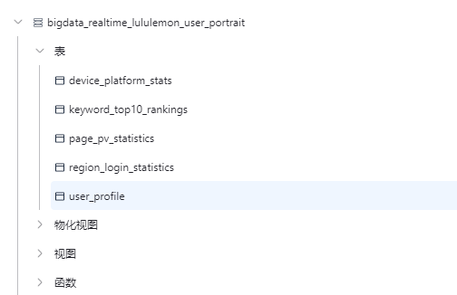

1.完成flink指标
2.数据写入doris  共五张表

CREATE DATABASE IF NOT EXISTS bigdata_realtime_lululemon_user_portrait;

USE bigdata_realtime_lululemon_user_portrait;

CREATE TABLE IF NOT EXISTS bigdata_realtime_lululemon_user_portrait.user_profile (
    `user_id` VARCHAR(255) NOT NULL COMMENT "用户ID",
    `login_dates` VARCHAR(1000) COMMENT "登录日期列表(逗号分隔)",
    `login_days_count` INT COMMENT "登录天数",
    `login_periods` VARCHAR(500) COMMENT "登录时段列表(逗号分隔)",
    `has_purchase` VARCHAR(5) COMMENT "是否有购买行为: true/false",
    `has_search` VARCHAR(5) COMMENT "是否有搜索行为: true/false",
    `has_view` VARCHAR(5) COMMENT "是否有浏览行为: true/false",
    `first_login_date` VARCHAR(20) COMMENT "首次登录日期",
    `last_login_date` VARCHAR(20) COMMENT "最后登录日期",
    `update_time` DATETIME COMMENT "更新时间"
)
ENGINE=OLAP
UNIQUE KEY(`user_id`)
COMMENT "用户画像表"
DISTRIBUTED BY HASH(`user_id`) BUCKETS 6
PROPERTIES (
    "replication_num" = "1",
    "storage_format" = "V2"
);internal.bigdata_realtime_lululemon_user_portrait.user_profile

select * from  bigdata_realtime_lululemon_user_portrait.user_profile;

CREATE TABLE IF NOT EXISTS bigdata_realtime_lululemon_user_portrait.page_pv_statistics (
    `stat_date` VARCHAR(20) NOT NULL COMMENT "统计日期",
    `page_type` VARCHAR(100) NOT NULL COMMENT "页面类型",
    `pv_count` BIGINT COMMENT "页面访问量",
    `update_time` VARCHAR(20) COMMENT "更新时间"
)
ENGINE=OLAP
UNIQUE KEY(`stat_date`, `page_type`)
COMMENT "页面访问量统计表"
DISTRIBUTED BY HASH(`stat_date`) BUCKETS 6
PROPERTIES (
    "replication_num" = "1",
    "storage_format" = "V2"
);

select * from bigdata_realtime_lululemon_user_portrait.page_pv_statistics;

CREATE TABLE IF NOT EXISTS bigdata_realtime_lululemon_user_portrait.keyword_top10_rankings (
    `id` BIGINT NOT NULL AUTO_INCREMENT COMMENT "自增ID",
    `keyword` VARCHAR(255) NOT NULL COMMENT "搜索词",
    `search_count` BIGINT DEFAULT 0 COMMENT "搜索次数",
    `ranking` INT COMMENT "排名",
    `update_time` VARCHAR(20) COMMENT "更新时间"
)
ENGINE=OLAP
UNIQUE KEY(`id`)
COMMENT "TOP10搜索词排名表"
DISTRIBUTED BY HASH(`id`) BUCKETS 6
PROPERTIES (
    "replication_num" = "1",
    "storage_format" = "V2"
);

select * from bigdata_realtime_lululemon_user_portrait.keyword_top10_rankings;

drop TABLE bigdata_realtime_lululemon_user_portrait.region_login_statistics;
CREATE TABLE IF NOT EXISTS bigdata_realtime_lululemon_user_portrait.region_login_statistics (
    `country` VARCHAR(50) NOT NULL COMMENT "国家",
    `province` VARCHAR(50) NOT NULL COMMENT "省份",
    `login_count` BIGINT SUM COMMENT "登录次数",
    `update_time` VARCHAR(20) REPLACE COMMENT "更新时间"
)
ENGINE=OLAP
AGGREGATE KEY(`country`, `province`)
COMMENT "地区登录统计表"
DISTRIBUTED BY HASH(`country`) BUCKETS 6
PROPERTIES (
    "replication_num" = "1",
    "storage_format" = "V2"
);

TRUNCATE TABLE region_login_statistics;

select * from bigdata_realtime_lululemon_user_portrait.region_login_statistics;

TRUNCATE TABLE bigdata_realtime_lululemon_user_portrait.device_platform_stats;

CREATE TABLE IF NOT EXISTS bigdata_realtime_lululemon_user_portrait.device_platform_stats (
    `stat_type` VARCHAR(50) NOT NULL COMMENT "统计类型(platform_type/brand/device_model/platform_version/software_version)",
    `stat_key` VARCHAR(200) NOT NULL COMMENT "统计键(平台类型/品牌名称/设备型号/版本号)",
    `stat_value` BIGINT COMMENT "统计值(数量)",
    `platform_type` VARCHAR(20) COMMENT "平台类型(iOS/Android/其他)",
    `update_time` VARCHAR(20) COMMENT "更新时间"
)
ENGINE=OLAP
UNIQUE KEY(`stat_type`, `stat_key`)
COMMENT "统一设备平台统计表"
DISTRIBUTED BY HASH(`stat_type`) BUCKETS 6
PROPERTIES (
    "replication_num" = "1",
    "storage_format" = "V2"
);
select * from bigdata_realtime_lululemon_user_portrait.device_platform_stats;

SELECT * FROM bigdata_realtime_lululemon_user_portrait.device_platform_stats
WHERE stat_type = 'brand'
ORDER BY platform_type, stat_value DESC;
SELECT stat_key as 平台类型, stat_value as 数量
FROM bigdata_realtime_lululemon_user_portrait.device_platform_stats
WHERE stat_type = 'platform_type'
ORDER BY stat_value DESC;

-- 2. 查询iOS品牌TOP10
SELECT stat_key as 品牌, stat_value as 数量
FROM bigdata_realtime_lululemon_user_portrait.device_platform_stats
WHERE stat_type = 'brand' AND platform_type = 'iOS'
ORDER BY stat_value DESC
LIMIT 10;

-- 3. 查询Android设备型号TOP10
SELECT stat_key as 设备型号, stat_value as 数量
FROM bigdata_realtime_lululemon_user_portrait.device_platform_stats
WHERE stat_type = 'device_model' AND platform_type = 'Android'
ORDER BY stat_value DESC
LIMIT 10;

