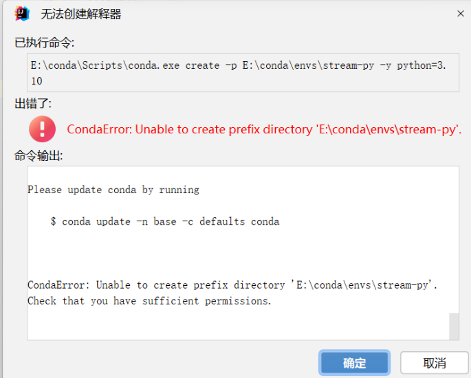
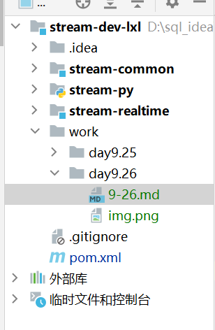
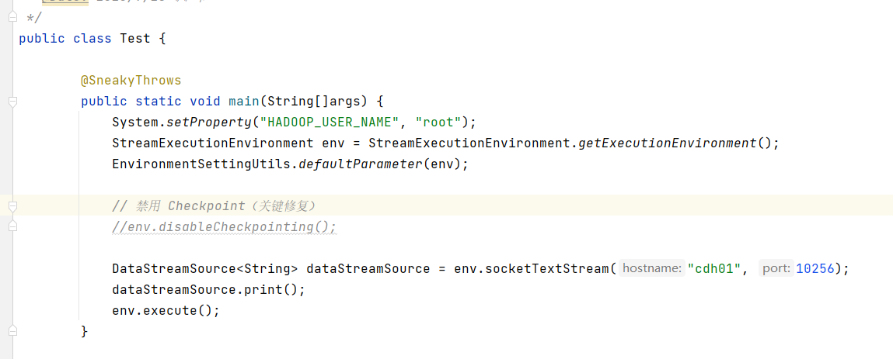

#9.26
#1.同步项目成功  pom依赖项加载成功
#2.创建conda环境

#2.1提示权限不足
以管理员身份运行命令提示符：
右键点击“命令提示符”或“Anaconda Prompt”，选择“以管理员身份运行”。
然后再次尝试运行创建环境的命令。
检查目录权限：
确保你有权限在 E:\conda\envs\ 目录下创建文件夹。
右键点击 E:\conda\envs\ 目录，选择“属性”，然后在“安全”选项卡中检查你的用户是否有“完全控制”的权限。

通过上述方法解决
#2.2成功创建conda环境

#
运行成功
